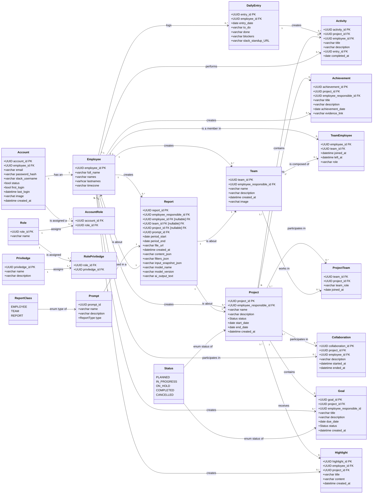

```mermaid
classDiagram
direction LR

class Team {
    +UUID team_id PK
    +UUID employee_responsible_id FK
    +varchar name
    +varchar description
    +datetime created_at
    +varchat image
}

class Employee {
  +UUID employee_id PK
  +varchar full_name
  +varchar names
  +varhcar lastnames
  +varchar timezone
}

class TeamEmployee {
    +UUID employee_id FK
    +UUID team_id FK
    +datetime joined_at
    +datetime left_at
    +varchar role
}

class Project {
    +UUID project_id PK
    +UUID employee_responsible_id FK
    +varchar name
    +varchar description
    +Status status
    +date start_date
    +date end_date
    +datetime created_at
}

class ProjectTeam {
    +UUID team_id FK
    +UUID project_id FK
    +varchar team_role
    +date joined_at
}


class Collaboration {
    +UUID collaboration_id PK
    +UUID project_id FK
    +UUID employee_id FK
    +varchar description
    +datetime started_at
    +datetime ended_at
}

class Goal {
    +UUID goal_id PK
    +UUID project_id FK
    +UUID employee_responsible_id
    +varchar title
    +varchar description
    +date due_date
    +Status status
    +datetime created_at
}

class Activity {
    +UUID activity_id PK
    +UUID project_id FK
    +UUID employee_id FK
    +varchar title
    +varchar description
    +UUID entry_id FK
    +date completed_at
}

class DailyEntry {
    +UUID entry_id PK
    +UUID employee_id FK
    +date entry_date
    +varchar to_do
    +varchar done
    +varchar blockers
    +varchar slack_standup_URL
}

class Achievement {
    +UUID achievement_id PK
    +UUID project_id FK
    +UUID employee_responsible_id FK
    +varchar title
    +varchar description
    +date achievement_date
    +varchar evidence_link
}

class Report {
    +UUID report_id PK
    +UUID employee_responsible_id FK
    +UUID employee_id FK [nullable] FK
    +UUID team_id FK [nullable] FK
    +UUID project_id FK [nullable] FK
    +UUID prompt_id FK
    +date period_start
    +date period_end
    +varchar file_url
    +datetime created_at
    +varchar content_json
    +varchar filters_json
    +varchar input_snapshot_json
    +varchar model_name
    +varchar model_version
    +varchar ai_output_text

}

class Account{
    +UUID account_id PK
    +UUID employee_id FK
    +varchar email
    +varchar password_hash
    +varchar slack_username
    +bool status
    +bool first_login
    +datetime last_login
    +varchat image
    +datetime created_at
}

class Status{
  PLANNED
  IN_PROGRESS
  ON_HOLD
  COMPLETED
  CANCELLED
}

class AccountRole{
    +UUID account_id FK
    +UUID role_id FK
}

class Role{
    +UUID role_id PK
    +varchar name
}

class RolePriviledge{
    +UUID role_id FK
    +UUID priviledge_id FK
}

class Priviledge{
    +UUID priviledge_id PK
    +varchar name
    +varchar description
}

class Highlight{
    +UUID highlight_id PK
    +UUID employee_id FK
    +UUID project_id FK
    +varchar title
    +varchar content
    +datetime created_at
}

class Prompt{
    +UUID prompt_id
    +varchar name
    +varchar description
    +ReportType type
}

class ReportClass{
    EMPLOYEE
    TEAM
    REPORT
}

Account "1" --> "1..*" AccountRole: is assigned a
Role "1" --> "1..*" AccountRole: assigns

Role "1" --> "1..*" RolePriviledge: is assigned
Priviledge "1" --> "1..*" RolePriviledge: assigns

DailyEntry "1" --> "0..*" Activity : creates

Project "1" --> "0..*" Goal : contains
Project "1" --> "0..*" Achievement : contains
Project "1" --> "0..*" Activity : contains
Project "1..*" --> "0..*" ProjectTeam : participates in
Project "1..*" --> "0..*" Collaboration : participates in
Project "1..*" --> "0..*" Highlight : receives


Employee "1" --> "0..*" DailyEntry : logs
Employee "1" --> "0..*" Achievement :creates
Employee "1" --> "0..*" TeamEmployee : is a member in
Employee "1" --> "0..*" Team:creates
Employee "1..*" --> "0..*" Collaboration : participates in
Employee "1" --> "0..*" Report :creates
Employee "1" --> "0..*" Project: creates
Employee "1" --> "0..*" Goal: creates
Employee "1" --> "0..*" Activity: performs
Employee "1" --> "0..*" Highlight: creates

Team "1*" --> "0..*" TeamEmployee : is composed of
Team "1..*" --> "0..*" ProjectTeam : works in

Report "1" --> "1" Employee: is about
Report "1" --> "1" Project: is about
Report "1" --> "1" Team: is about

Account "1" --> "1" Employee: has an
Status "" --> "" Project: enum status of
Status "" --> "" Goal: enum status of

Prompt "1" --> "1" Report: is used in a
ReportClass "" --> "" Prompt: enum type of
```