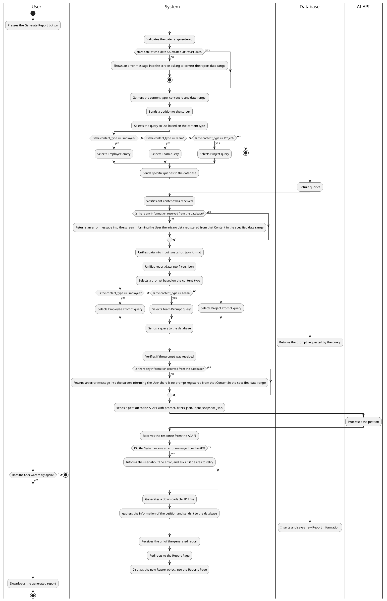

```plantuml

@startuml
|User|
start
:Presses the Generate Report button;
|System|
:Validates the date range entered;
if (start_date <= end_date && created_at<=start_date?) is (no) then
  :Shows an error message into the screen asking to correct the report date range;
  stop
else(yes)
endif

|System|
:Gathers the content type, content id and date range.;
:Sends a petition to the server;
:Selects the query to use based on the content type;

if (Is the content_type == Employee?) is (yes) then
  :Selects Employee query;
  elseif  (Is the content_type == Team?) is (yes) then
    :Selects Team query;
    elseif  (Is the content_type == Project?) is (yes) then
      :Selects Project query;
    else(no)
    stop
  endif

:Sends specific queries to the database;

|Database|
:Return queries;

|System|
:Verifies ant content was received;

if(Is there any information received from the database?) is (no) then
  :Returns an error message into the screen informing the User there is no data registered from that Content in the specified data range;
else(yes)
endif

:Unifies data into input_snapshot_json format;
:Unifies report data into filters_json;
:Selects a prompt based on the content_type;

if (Is the content_type == Employee?) is (yes) then
:Selects Employee Prompt query;
  else if (Is the content_type == Team?) is (yes) then
      :Selects Team Prompt query;
  else(no)
  :Selects Project Prompt query;
endif

:Sends a query to the database;
|Database|
:Returns the prompt requested by the query;

|System|
:Verifies if the prompt was received;
if(Is there any information received from the database?) is (no) then
  :Returns an error message into the screen informing the User there is no prompt registered from that Content in the specified data range;
else(yes)
endif

label step15
:sends a petition to the AI API with prompt, filters_json, input_snapshot_json;
|AI API|
:Processes the petition;
|System|
:Receives the response from the AI API;
if(Did the System receive an error message from the API?) is (yes) then
  :Informs the user about the error, and asks if it desires to retry;
  |User|
  if(Does the User want to try again?) is (yes) then
  goto step15
  else(no)
  stop
  endif
  |System|
else(no)
endif

:Generates a downloadable PDF file;
:gathers the information of the petition and sends it to the database;

|Database|
:Inserts and saves new Report information;

|System|
:Receives the url of the generated report;
:Redirects to the Report Page;
:Displays the new Report object into the Reports Page;
|User|
:Downloads the generated report;
stop

@enduml
```